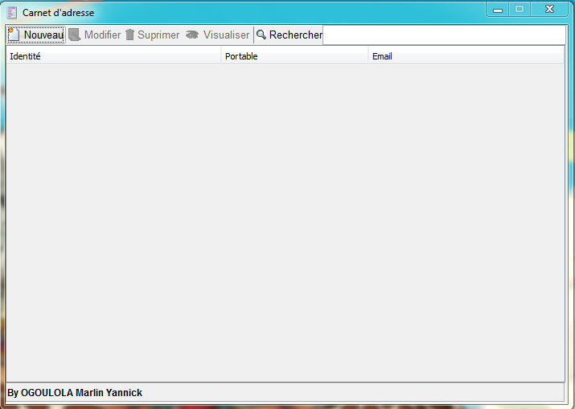

# Carnet d'adresses avec MySQL
C'est une application qui permert d'enregistrer des informations importantes de  vos contacts, avec utilisation du pattern DAO

*Source orignina*l : http://codes-sources.commentcamarche.net/source/100687-carnet-d-adresses-avec-mysqlAuteur

